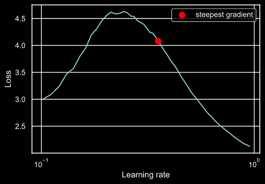
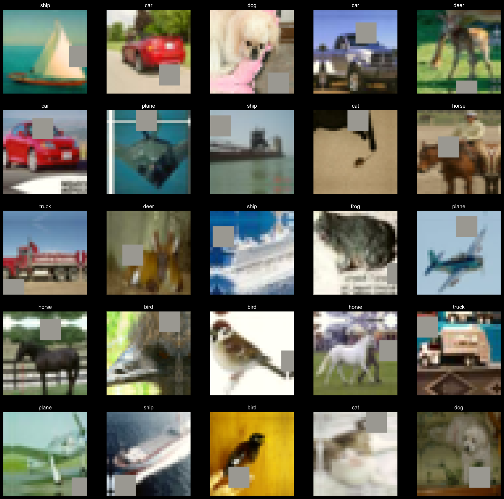
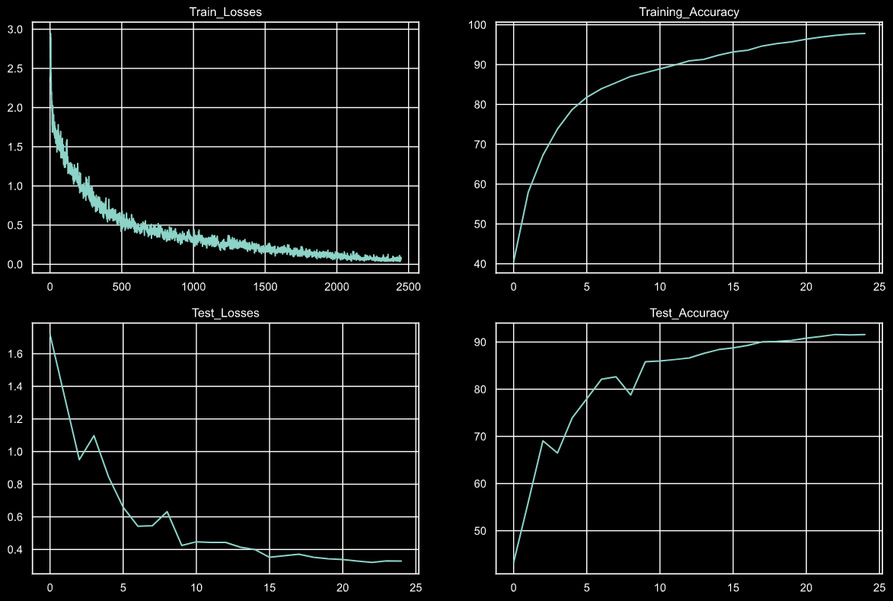

# SuperConvergence
> Nikhil Shrimali

## Model - <a href = 'https://github.com/nikshrimali/shrinkai/blob/master/model/model11.py'>DavidNet</a>
- Batch size - 512
- One Cycle LR
> 

- Augmentations - RandomCrop 32, 32 (after padding of 4) >> FlipLR >> Followed by CutOut(8, 8)
> 

- Model's Performance

> 