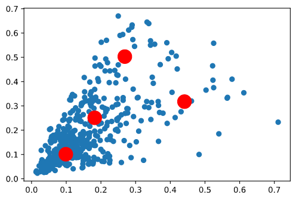

# Training Imagenet
> Nikhil Shrimali

## Training
 - Model - <a href = 'https://github.com/nikshrimali/shrinkai/blob/master/model/resnetmodel12.py'>ResNet18 - 200 classes</a>
- Batch size - 256
- Augmentations
    - Padding to 70, 70 
    - RandomCrop 64, 64 (after padding of 4)
    - FlipLR 
    - CutOut(16,16) Filled with Mean Values

- OneCycleLR
    - MaxLR - 0.808
    - Division Factor - 1/10

## Model's Performance

- No of parameters - 11,271,432
- No of epochs - 50
- Dropout - 0%
- Starting training accuracy - 5.18%
- Starting testing accuracy - 8.49%
- Max training accuracy - 98.43%
- Max testing accuracy - 58.08%

> 

*******************************************
# YoLo Anchor Boxes

## Data cleaning

- Over here we have mainly 6 types of info available with us. One is X,Y which stands for the X,Y coordinates of the centroids of the Bounding boxes.
- The width and height columns signifies dimensions of the rectangular bounding box (shape column)
- The file which is being referred to, is the filename bounding box

Below info is present for each image in the annotated dataset
- Json key is Name of each image
- Json Values are as below
    - region_attributes - Contains the class name
    - shape_attributes - Contains the info about the bounding box in image. One is X,Ywhich stands for the X,Y coordinates of the centroids of the Bounding boxes. and The width and height columns signifies dimensions of the rectangular bounding box (shape column)

## Data After Cleanup
> 

## KMeans Predictions

We can see an elbow at 4, which means increasing further won't make much difference
> 

We are clustering out datapoints wrt to Predicted clusters
> 

