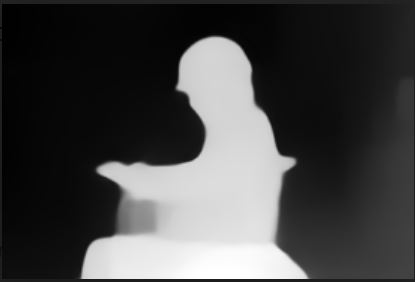
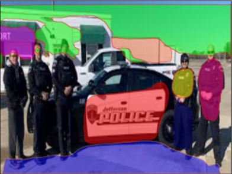

# PlaneRCNN and MiDaS

> Submitted by - Nikhil Shrimali

## Agenda - Generating depth information of the images

Now as we already have helmet, mask, PPE, and boots dataset from last assignment's collective efforts at TSAI, the next task is to get depth information out from the images, we use below two models

  - <a href='https://github.com/intel-isl/MiDaS'>MiDaS</a> Mixing Datasets for Zero-shot Cross-dataset Transfer from Intel

  - <a href='https://github.com/NVlabs/planercnn'>PlaneRCNN</a> This model proposes a deep neural architecture, PlaneR-CNN, that detects arbitrary number of planes, and reconstructs piecewise planar surfaces from a single RGB image.

## Output Generated:

<a href='https://drive.google.com/drive/folders/19F_Xx3ekwIYTMCsR9EVuyR3PBYPS1l4y?usp=sharing'>**Dataset Output** </a> <- Drive link to the output generated from above models

### MiDaS Output

### PlaneRCNNS Output
