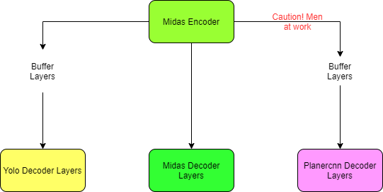

# The Kedgeree

> Submitted by - Nikhil Shrimali

# Architecture

- <a href = 'https://github.com/nikshrimali/TSAI_EVA/blob/master/15_TheCapStone/Training_model.ipynb'> ** Click here **</a> For Notebook that contains code of training the ensemble model
- <a href = 'https://github.com/nikshrimali/TSAI_EVA/blob/master/15_TheCapStone/Inference_Model.ipynb'> ** Click here **</a> For Notebook that cotains code of output generated by inference on emsemble model

I have modified the architecture to extract the decoder layers from YoloV3 and Planercnn models, they can be found at Github link below

- Midas Model - Used as it is (Encoder + Decoder). Download whole MidasNet from Github repo from <a href = 'https://github.com/intel-isl/MiDaS'> Here</a>
- Yolo Model - Decoder Layers only. Git repo for only the decoder layers can be found <a href = 'https://github.com/nikshrimali/YoloV3'> Here</a>
- Planercnn - Decoder Layers only Git repo extracting the whole planercnn layers can be found <a href = 'https://github.com/NVlabs/planercnn'> Here</a> (Work in Progress)

## Training the Model (Yolo Layer only)

- Currently only Yolo branch (Buffer layers to match the output)
- Not training Midas Encoders and Decoders
- Planercnn is still work in progress.
- Please note that by default encoders and decoders params are frozen, you can unfreeze them by looping and setting require_grad = True before sending them to Ensemble model class
- I have trained the entire architecture on my local machine. Ensemble model can be found <a href = '#'> Here</a>

  - Step 1 - Download all the models from their Repo's and place them in directory models_all
  - Step 2 - For training Yolo Branch, we need to get bounding boxes data
      - Annotate the data using the  <a href = 'https://github.com/miki998/YoloV3_Annotation_Tool'>YoloV3 Annotation Tool</a>
      - Follow the steps to generate custom training data similar to Yolo mentioned  <a href = '#'> Here</a>
  - Step 3 - Download the ensemble model from gdrive link
  - Step 4 - Run Training_model.ipynb file to train the model
  - Step 5 - Run Inference_model.ipynb file to generate inference from the custom model
  - Step 6 - Outputs can be found in the custom_data/outputs/ directory

- I have utilized the <a href = 'https://drive.google.com/file/d/1wyjIOERwuAatnaXkNWVH59ojf_-7M7D8/view?usp=sharing'>YoloV3 Pretrained PPE Model</a> trained 273 epochs which can be downloaded frpm here. Paste it to YoloV3/Pretrained_model directory

# Output Generated

## Work Finished

- I am able to create ensemble model with Midas and Yolo Layers
- Each layer can be trained with setting the parameters in model
- Able to connect both and generate outputs
- I am also able to train the model (Yolo Buffer Layers)
- All previous issues related to testing pipeline of the Yolo output model are resolved

## Work Pending

- Model needs to be trained further to get better outputs on the Yolo layers. Current Map is 
- Making code as generic as possible, currently most variables and paths are hardcoded
- Combine RCNN decoder into the model
- Training RCNN model on custom dataset

