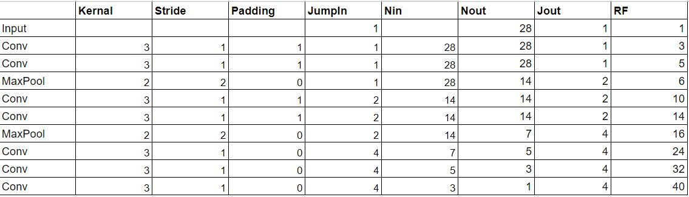
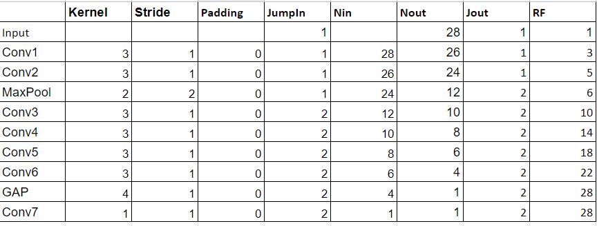
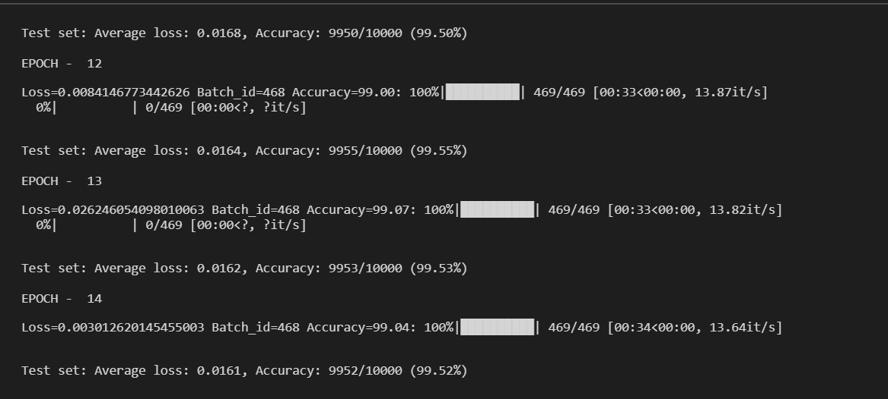

## Exp-1 - GAP

Pizza is almost ready, looks really good, lets add seasoning to enhance the taste

> GAP - 
Adding the GAP to squeeze that last bit of accuracy by calculating the receptive field, and a 1*1 convolution after that (Not an FC!!!)

Reduced params might lead to reduced accuracy, we will get to see how effective is GAP. We also did some receptive field calculations on our existing models and new planned model as shown below
 > Existing model

- As per our calculations based on the old model, the receptive field is going beyond 28 which is our input images size, lets correct that keeping all the other parameters same. 

- We will modify the model to keep the final receptive field equal to the size of the image. We will also apply a GAP (Global Average Pool of 4). We usually try to keep it to 7, but keeping in mind the dataset is MNIST we can start with 4.

> Upcoming Model

## Results

- No of parameters - 7076
- No of epochs - 15
- Dropout - *5%
- Starting training accuracy - 87.14
- Starting testing accuracy - 98.24
- Max training accuracy - 98.94%
- Max testing accuracy - 99.49%

### Analysis

- Underdog shines!!!! GAP works everyone!!! We did it!!! 

Logs are beautiful, graphs are beautiful, my life is beautiful. TSAI is beautiful

## Future Aspirations

- Mera ho gaya!!! :P

*********************************************

## Exp-2 - Dropout

I know, I am getting greedy, just wanted to do some experiments with Dropout, we are already too hard on the model, lets give the guy some slack.

> Dropout 3%

## Results

- No of parameters - 7076
- No of epochs - 15
- Dropout - *3%
- Starting training accuracy - 87.51
- Starting testing accuracy - 98.24
- Max training accuracy - 99.04%
- Max testing accuracy - 99.55%

### Analysis

> Model's Accuracy 

- We have outsmarted ourselves!!, reducing the dropout to 3%, improved out model's testing accuracy to 99.55% up from 99.49%.

- Adding too much regularization can alter the loss curve, as we add new regularizations, we should also balance off the old ones.

## Future Aspirations

- Abhi pakka ho gaya!!! :P :P