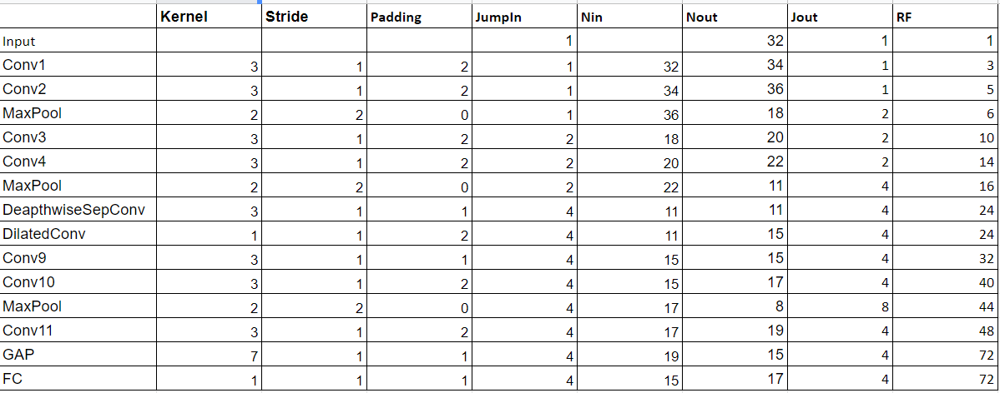

# Assignment-7

 Submitted by -
> Nikhil Shrimali

## Target  
- Fix the network
-change the code such that it uses GPU
- change the architecture to C1C2C3C40 (basically 3 MPs)
- total RF must be more than 44
- one of the layers must use Depthwise Separable Convolution
- one of the layers must use Dilated Convolution
- use GAP (compulsory):- add FC after GAP to target #of classes (optional)
- achieve 80% accuracy, as many epochs as you want. Total Params to be - - - less than 1M. 
- upload to Github

## Submission

I have trained model, summary and observationsd details can be found below.
The code is completely modularized and shrinkai is used where the source code exists

> Link to New Awesomeness - <https://github.com/nikshrimali/shrinkai>

#### Results

- No of parameters - 7,58,602
- No of epochs - 15
- Dropout - 10%
- Starting training accuracy - 62.37
- Starting testing accuracy - 60.68
- Max training accuracy - 89.83%
- Max testing accuracy - 81.18%

#### Obervations

- Model is overfitting

- I have used a deapthwise seperable convolution with 128 3*3 kernels followed by 128 1*1 kernels

- This is followed by a 128 3*3 dilated kernels (dilation = 2) concatened to a 128 3*3 kernels in total producing a total of 256 channels

- These 256 channels are then reduced t0 128 channele by a 1*1 convolution to filter the information

- At last a global Average Pooling layer of kernel = 7 is used

- This is followed by a fully connected layer (1*1 Convolution)

- Learning rate is changed to 0.01 results in model to converge faster

## Future Aspirations

- Need to add image augmentations to have a regularizing effect on the dataset

## Receptive Field Calculations

