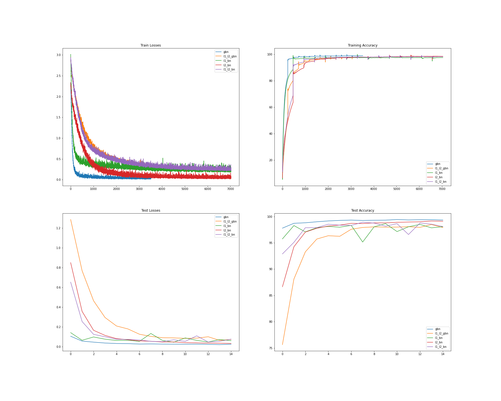
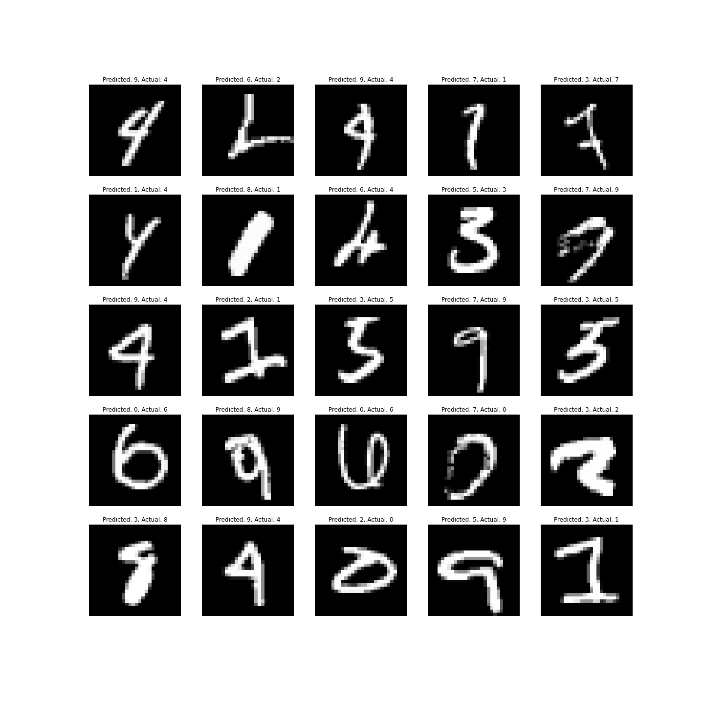

# Assignment-6

 Submitted by - Team Evangers
 - Nikhil Shrimali
 - Aishwarya Anand
 - Balaji B
 - Manivel Sethu

## Target  

Fix the network above:
change the code such that it uses GPU
change the architecture to C1C2C3C40 (basically 3 MPs)
total RF must be more than 44
one of the layers must use Depthwise Separable Convolution
one of the layers must use Dilated Convolution
use GAP (compulsory):- add FC after GAP to target #of classes (optional)
achieve 80% accuracy, as many epochs as you want. Total Params to be less than 1M. 
upload to Github
Attempt S7-Assignment Solution

## Our Submission

#### Results

- No of parameters - 7076
- No of epochs - 15
- Dropout - *3%
- Starting training accuracy - 78.40
- Starting testing accuracy - 97.28
- Max training accuracy - 98.36%
- Max testing accuracy - 99.22%

#### Obervations

The model is not able to achive the accuracy of our last model which was < 99.5%

GBN is known to have a regularization effect on the 

### No of Splits - 8 and Variable Learning Rate

> GBN can also have a regularizing effect

#### Results

- No of parameters - 7076
- No of epochs - 15
- Dropout - *3%
- Starting training accuracy - 80.56
- Starting testing accuracy - 97.93
- Max training accuracy - 98.53%
- Max testing accuracy - 99.39%

#### Obervations

- Increase in training and the testing (~.5%) accuracy 
The model is not able to achive the accuracy of our last model which was < 99.5%
- Training accuracy is continuously increasing, but the effect is not visible on the testing accuracy, this could be the case that we are regularizing too  much, since GBN can also have a regularizing effect.

- Model might be underfitting

- Also many ups and downs in the testing curves, the learning rate seems to be too high

### No of Splits - 4 and Less Image Augmentation

> When we add a new regularizer, to balance it off, we should also decrease the old ones, otherwise this could change the loss curve. Only small changes are required at a time.

#### Results

- No of parameters - 7076
- No of epochs - 15
- Dropout - *3%
- Starting training accuracy - 83.12
- Starting testing accuracy - 97.79
- Max training accuracy - 98.93%
- Max testing accuracy - 99.43%

#### Obervations

- Increase in starting training and decrease testing in (~.5%) accuracy 

- The max training and testing accuracy has not much changes, but testing accuracy curve is consistent in the final epochs, hence this looks like an improvement over the previous models

### L1+L2+ Ghost BN

> L1 and L2 provides additional regularizations. Expect the model to underfit

#### Results

- No of parameters - 7076
- No of epochs - 15
- Dropout - *3%
- Starting training accuracy - 50.50
- Starting testing accuracy - 75.65
- Max training accuracy - 97.83%
- Max testing accuracy - 98.48%
- L1 Regularization - 0.0001
- L2 Regularization - 0.0001

#### Obervations

- Decrease in training and the testing (~1%) accuracy 

- Huge spikes in the testing accuracy curve. This could be overshooting the learning rate

- Model might be underfitting

- We can conclude there is too much regularization as we have applied all the available regularizations we have

### L1 + Normal BN

> L1 and Normal BN

#### Results

- No of parameters - 7076
- No of epochs - 15
- Dropout - *3%
- Starting training accuracy - 88.59
- Starting testing accuracy - 95.65
- Max training accuracy - 97.6%
- Max testing accuracy - 98.65%
- L1 Regularization - 0.0001
- L2 Regularization - 0

#### Obervations

- Decrease in training and the testing (~1%) accuracy 

- Huge spikes in the testing accuracy curve. This could be overshooting the learning rate

- Model might be underfitting

- This model started on a strong note, but there are almost 3% spikes in testing accuracy. This seems really strange behavior. The training accuracy increase is consistent, but is limited to a very small range.

- The model is not consistent

### L2 + Normal BN

> L2 and Normal BN

#### Results

- No of parameters - 7076
- No of epochs - 15
- Dropout - *3%
- Starting training accuracy -  63.67
- Starting testing accuracy - 86.65
- Max training accuracy - 98.52%
- Max testing accuracy - 99.15%
- L1 Regularization - 0
- L2 Regularization - 0.0001

#### Obervations

- Increase in training and the testing (~1%) accuracy over the L1 + Normal BN

- There are no huge spikes in the testing accuracy curve. This model is underperforming, the testing accuracy curve is increasing linearly and no worrsome spikes

- Model might be underfitting

- This model started on a weak note, but caught up in the end to get a consistent performance, even though still underfitting

### L1 + L2 + Normal BN

> L1 + L2 and Normal BN

#### Results

- No of parameters - 7076
- No of epochs - 15
- Dropout - 3%
- Starting training accuracy -  69.02
- Starting testing accuracy - 92.89
- Max training accuracy - 98.52%
- Max testing accuracy - 98.76%
- L1 Regularization - 0.0001
- L2 Regularization - 0.0001

#### Obervations

- Decrease in training and the testing (~.5%) accuracy over the L2 + Normal BN

- There are  huge spikes in the testing accuracy curve. This model is underperforming, this could mean that L1 regularization can have these spike effect when applied

- Model is underfitting

## Performance Metrics for all models

## Some instances of misclassified images by our best performer GBN

