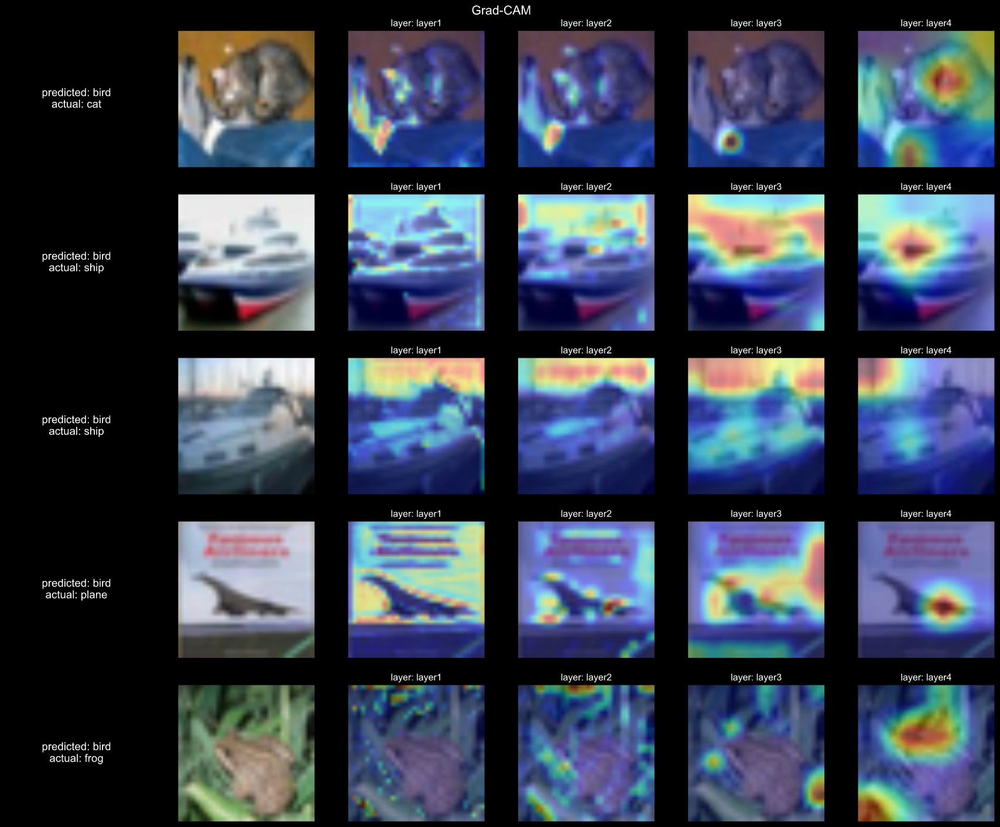

# Augmentations and Gradcam - Assignment 09
> Nikhil Shrimali

## Albumentations
In this Assignment, I have applied Albumentations as my default Augmentations, some of the noteworthy implemtations are
- Cutouts
- Elastic Transforms
- RandomBrightnessContrast
- RandomBrightnessContrast
- ElasticTransform
- ShiftScaleRotate
- RandomCrop

This has huge regularizing effect on the model, hence kept dropout to 0%.

The training accuracy has maxed out to 62% due to huge regulaziations by Albumentations, but the testing accuracy is holding good at ~88%.

I have manually changes Learning Rates. For first 20 epochs I have used 0.01 as LR after that I have trained the model for another 8 epochs with an LR to 0.001.as_integer_ratio

## Gradcam
A noteworthy implemtation in this exercize if the implementaion of GradCam to get the answers from model about what exactly it is learning. Gone are the days when deep neural networks were a black box to us.

To have some answers from the model, we can pass the layers to the models, in image attached in this file, I have plotted GradCam for each of the layer in the network.

As you can see in the initial layers, the model is detecting textures, patterns, gradients, and focus is more on the object on in the last layers. The model is slowly begining to analyse the objects in the last layers

## Submission

I have trained model, summary and observations can be found below.
The code is completely modularized and shrinkai is used where the source code exists

> Link to New Awesomeness - <a href= "https://github.com/nikshrimali/shrinkai"> Visit SHRINKAI</a>

#### Results

- No of parameters - 11,173,962
- No of epochs - 20 + 8 
- Dropout - 0%
- Max training accuracy - ~62%
- Max testing accuracy - ~88%

#### Obervations

- Model seems to be underfitting.

- I have blindly applied the augmentations on the model, with focus on a better approach for that, which improves model's accuracy.

- Model was training at the test accuracy of ~84%, but after when training was restarted for another 8 epochs at 0.001 LR the accuracy jumped to start of 87%. Need more clarity on that. 

## Future Aspirations

- I have added the image augmentations, but need more intution on what augmentations works on which dataset
- Have to play with intelligent implementations of Learning Rates, see you in next session.
