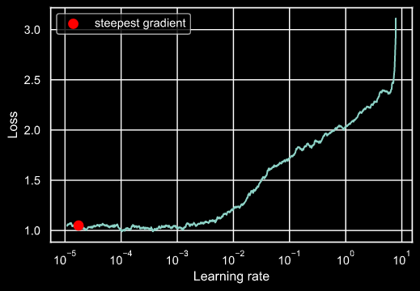

# Augmentations and Gradcam - Assignment 10
> Nikhil Shrimali

## Albumentations
In this Assignment, I have applied Albumentations blindly on the dataset, but when I observed the data, many labels were lost due to that. Target of augmentations should be to enhance the dataset and to train the model for those scenarios that can happen in real world. Hence changes the augmentations. Images can be seen in the code.

## Gradcam
For this submission, I have identified the images that were wrongly classified and try to find out why this was the case.

 > Misclassified
 

## Learning Rates

The learning rate is identified using LR finder approach, this has been integrated in Shrinkai library, the calculation has been done on local machine and hence selected best LR. Here the calculation is only for illustrative purposes.

> Learning Rate curve

